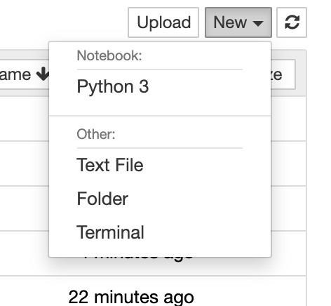

Install omero-py
================

In this section, we show how to install omero-py together with additional packages 
for image analysis in a `Conda <https://conda.io/en/latest/>`_ environment.

We will use the Python API to access data stored in an OMERO server. The image analysis
is typically done with packages like `scikit-image <https://scikit-image.org/>`_ 
or `dask <https://dask.org/>`_.

If you want to use the Python API only for interacting with the OMERO server, like 
scripting management / import workflows you can just install the omero-py package 
by itself, see `omero-py <https://github.com/ome/omero-py/blob/master/README.rst>`_.

Setup
-----

For using the examples and notebooks of this guide we recommend using Conda (Option 1).
Conda manages programming environments in a manner similar to 
`virtualenv <https://virtualenv.pypa.io/en/stable/>`_.

Alternatively you can use ``repo2docker`` to build and run a Docker image locally (Option 2).
This Docker image will provide the Conda environment and Jupyter notebooks with some image 
analysis workflows.

When the installation is done, you should be ready to use the OMERO Python API, see :doc:`gettingstarted`.

*Option 1*
~~~~~~~~~~

Install omero-py and additional packages for image analysis (see 
:download:`environment.yml <../binder/environment.yml>`) via Conda.

- Install `Miniconda <https://docs.conda.io/en/latest/miniconda.html>`_ if necessary.

- If you do not have a local copy of the `omero-guide-python repository <https://github.com/ome/omero-guide-python>`_, first clone the repository::

    $ git clone https://github.com/ome/omero-guide-python.git

- Go into the directory::

    $ cd omero-guide-python

- Create a programming environment using Conda::

    $ conda create -n omeropy python=3.6

- Install ``omero-py`` and other packages useful for demonstration purposes in order to connect to an OMERO server using an installation file::

    $ conda env update -n omeropy --file binder/environment.yml 

- Activate the environment::

    $ conda activate omeropy

*Option 2*
~~~~~~~~~~

Create a local Docker Image using ``repo2docker``, see :download:`README.md <https://github.com/ome/omero-guide-python/blob/master/README.md>`::

    $ pip install jupyter-repo2docker
    $ git clone https://github.com/ome/omero-guide-python.git
    $ cd omero-guide-python
    $ repo2docker .

When the Image is ready:

- Copy the URL displayed in the terminal in your favorite browser

- Click the ``New`` button on the right-hand side of the window

- Select ``Terminal``

- A Terminal will open in a new Tab

- A Conda environment has already been created when the Docker Image was built

- To list all the Conda environments, run::

    $ conda env list

- The environment with the OMERO Python bindings and a few other libraries is named ``notebook``, activate it::

    $ conda activate notebook
