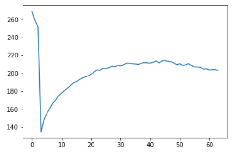
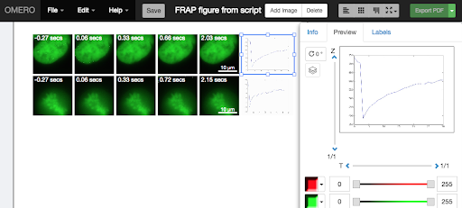

OMERO.py scripting - Simple FRAP
================================

**Description:**
----------------

We will use Jupyter notebooks to introduce the OMERO Python API. See
docs for OMERO Python at
https://docs.openmicroscopy.org/latest/omero/developers/Python.html.

We will use various code examples from that page to begin a very simple
FRAP analysis. All the examples use the BlitzGateway connection wrapper “conn” to
access data in OMERO.

**Setup:**
----------

-  The following OMERO.scripts are used for the OMERO.scripts section below:

   -  https://github.com/ome/training-scripts/blob/v0.6.0/practical/python/server/simple_frap.py

   -  https://github.com/ome/training-scripts/blob/v0.6.0/practical/python/server/simple_frap_with_figure.py

-  The scripts should be uploaded to the server as described at https://docs.openmicroscopy.org/latest/omero/developers/scripts/user-guide.html#upload-script.

-  You will need a python environment with OMERO.py libraries installed as described at
   https://docs.openmicroscopy.org/latest/omero/developers/Python.html.
   We will use a web-based Python notebook instead of installing OMERO.py locally.

**Resources:**
--------------

-  FRAP images available at https://downloads.openmicroscopy.org/images/DV/will/FRAP/

**Step by step:**
-----------------

#.  Go to https://idr-analysis.openmicroscopy.org/training

#.  Load the notebook *Files > notebooks > Python > OMEROHelloWorldNotebook.ipynb*. The first step is already loaded for you:

    ::

        from omero.gateway import BlitzGateway
        from getpass import getpass
        conn = BlitzGateway(input("Username: "), getpass("OMERO Password:"), host="workshop.openmicroscopy.org", port=4064)
        conn.connect()

#.  Go to webclient, browse your data and find the **FRAP** images.

#.  Note the ID of the first image in the Dataset.

#.  Double-click on this Image to open it in OMERO.iviewer.

#.  Play the timelapse in OMERO.iviewer.

#.  Draw in OMERO.iviewer a Rectangle ROI on the spot which was bleached.

#.  Save the ROI.

#.  Go back to the Jupyter notebook. First list the ROIs and Shapes
    saved on the Image, using the image_id of the image you just
    worked with in iviewer.

#.  Enter your username and password when requested.

#.  You may wish to ‘Cut’ (remove) the remaining steps from the *HelloWorld* example before adding your own.

#.  Add a new step with this code, setting the image_id to the Image you just edited.

    ::

        image_id = 123
        roi_service = conn.getRoiService()
        result = roi_service.findByImage(image_id, None)
        x = 0
        y = 0
        width = 0
        height = 0
        for roi in result.rois:
            for s in roi.copyShapes():
                if type(s) == omero.model.RectangleI:
                    x = s.getX().getValue()
                    y = s.getY().getValue()
                    width = s.getWidth().getValue()
                    height = s.getHeight().getValue()
        print("Rectangle:", x, y, width, height)

#.  With the Rectangle x, y, width, height, we can get pixel data for
    this Tile across all time points and make a list of mean
    intensity values. Add a new step with this code:

    ::

        the_c = 0
        the_z = 0
        tile = (int(x), int(y), int(width), int(height))
        pixels = image.getPrimaryPixels()
        size_t = image.getSizeT()
        zct_list = [(the_z, the_c, t, tile) for t in range(size_t)]
        planes = pixels.getTiles(zct_list)
        meanvalues = []
        for i, p in enumerate(planes):
            meanvalues.append(p.mean())
        print(meanvalues)

#.  We can add these values as a Map Annotation (Key-Value pairs) on the image:

    ::

        import omero
        image = conn.getObject('Image', image_id)
        key_value_data = [[str(t), str(meanvalues[t])] for t in range(size_t)]
        map_ann = omero.gateway.MapAnnotationWrapper(conn)
        namespace = "demo.simple_frap_data"
        map_ann.setNs(namespace)
        map_ann.setValue(key_value_data)
        map_ann.save()
        image.linkAnnotation(map_ann)

#.  Plot values with Matplotlib:

    ::

        from PIL import Image
        import matplotlib
        from matplotlib import pyplot as plt
        matplotlib.use('Agg')
        fig = plt.figure()
        plt.subplot(111)
        plt.plot(meanvalues)
        fig.canvas.draw()
        fig.savefig('plot.png')
        pil_img = Image.open('plot.png')
        pil_img.show()

    This will create a *plot.png* in the current folder. Click to view it.

    |image0|

**Using OMERO.scripts**

#.  Go to the webclient, select the Image you have drawn the ROI on.

#.  Note the new Map Annotation (Key-Value pairs).

#.  If desired, draw an Ellipse as above (T unset) on additional FRAP
    Images to analyse.

#.  Select the image(s) and Open the script *workshop_scripts > simple frap...*

#.  Click on the *View script* link in the bottom-left corner and
    inspect the script - basically, the script does what you have
    done in the Jupyter notebook up till now.

#.  Run the script, then observe that a new Map Annotation appeared on
    the image with the FRAP values.

#.  Now select the script *workshop_scripts > simple frap with figure...*

#.  Inspect this script as well, it is basically an extension of the
    *simple frap* script with the creation of OMERO.figure at the
    end. New images are created in OMERO from the FRAP plots and
    included in the figure.

#.  Run the script on the image. Note in *Activities*, the ID of the
    newly created figure.

#.  Open OMERO.figure, and go to *File > Open...* to open the newly
    created figure (named **FRAP Figure from script**).

    |image1|

